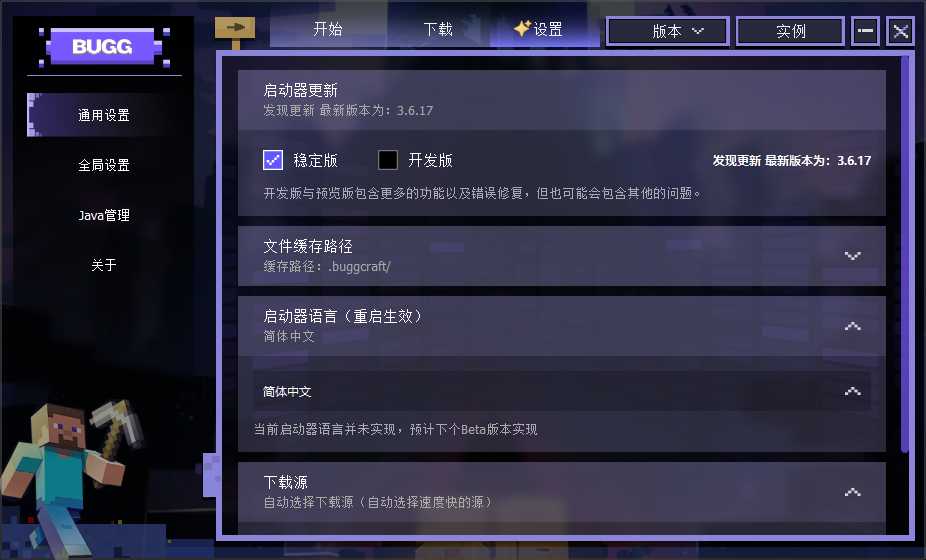

# 🎮 Bugg Minecraft Launcher 启动器

[](LICENSE)
[](./COMMUNITY_LICENSE.md)

[](https://github.com/vdjango/buggcraft/commits/main)
[](https://github.com/vdjango/buggcraft/issues)
[](https://github.com/vdjango/buggcraft)
[](https://www.python.org/)
[](https://github.com/vdjango/buggcraft/releases)

**buggcraft Launcher 是一款由热爱驱动的开源 Minecraft 启动器，致力于在现代化设计、无缝联机体验和社区驱动理念上树立新标准。** 我们以用户体验为核心，通过深度集成的**高性能隧道技术**实现一键**跨网络联机**，结合符合 Minecraft 美学的界面设计和轻量化架构，为玩家提供更**直观、稳定、愉悦**的游戏启动体验。本项目坚持开源透明，鼓励社区共建，旨在为 Minecraft 生态带来一个**免费、开放、以连接为导向的全新选择。​**


**周期**

|✨ UI 设计|📚 程序页面布局|功能实现|截至时间|
|-|-|-|-|
|开始首页|✅ 完成|✅ 完成|2025-09-30|
|​设置-通用设置|✅ 完成|✅ 部分完成|2025-10-08|
|​设置-Java管理|✅ 完成|🚧 开发中|-|
|​设置-下载|✅ 完成|🚧 开发中|2025-10-08|
|​设置-关于|✅ 完成|🚧 开发中|-|
|​版本管理-版本列表|✅ 完成|✅ 完成|2025-10-02|
|​版本管理-版本设置|✅ 完成|✅ 完成|2025-10-02|
|​版本管理-游戏安装|🚧 开发中|🚧 开发中|-|
|​联机大厅|待开发|🚧 开发中|-|
|​联机服务端|待开发|🚧 开发中|-|
|​联机客户端|待开发|✅ 完成|-|
|​联机主机端|待开发|✅ 完成|-|

## ✨ 与众不同的设计理念

**为体验而生，为连接而设计，为社区而开源**

从界面效果到操作流程，每一个细节都经过精心打磨。
打破传统联机的技术壁垒，让玩家专注于游戏乐趣而非网络配置。无论是局域网好友还是异地同伴，都能轻松建立稳定连接。
坚持开源理念，确保项目的透明度和可持续性。鼓励社区参与，共同打造真正属于玩家的启动器生态。




### 🎨 现代化设计语言

界面元素运用像素风格的图标进行控件设计，色彩取自小黑深邃的暗紫色。布局采用网格系统确保视觉对齐，所有组件都遵循统一的间距规范。

* **​​现代化设计语言​​：** 采用符合 Minecraft 美学风格的界面设计，让每一次启动都充满仪式感
* **直观操作流程​​：** 简化复杂配置，降低新手玩家的上手门槛
* **愉悦的交互反馈​​：** 精心设计的动画和过渡效果，提升整体使用感受

### 🌐 深度集成的联机生态

重塑 Minecraft 联机体验的开源启动器，通过深度集成的高性能隧道技术，彻底解决了传统联机方式中复杂的网络配置问题，使玩家能够实现一键式跨网连接。此外，客户端环境同步功能，确保了模组联机时版本的绝对一致，从根源上避免了兼容性困扰


**智能局域网发现**

1. 自动扫描并显示同一网络下的可用游戏会话
2. 支持游戏版本匹配验证，避免兼容性问题
3. 实时状态更新，快速加入好友的世界

**一键互联网联机**

1. ​​无需公网IP​​：通过先进的隧道技术实现跨网络直连
2. ​简化操作流程​​：单个按钮即可创建可被互联网访问的游戏房间
3. 自适应网络环境​​：智能选择最优连接路径，保证传输质量

**分布式联机网络**

1. ​社区服务器支持​​：爱好者可轻松部署公共联机节点
2. 自动服务发现​​：新上线的隧道服务自动加入可用网络
3. 负载均衡机制​​：智能分配联机流量，确保服务稳定性

**客户端环境同步**

1. ​​模组版本管理​​：主机可分享完整的客户端配置包
2. ​一键环境部署​​：好友快速获取匹配的游戏环境和资源
3. ​​依赖自动解析​​：智能处理模组依赖关系，确保兼容性

**安全的房间管理**

1. ​​密码保护机制​​：创建私有游戏房间，防止未经授权的访问
2. ​灵活的权限控制​​：支持多种玩家角色和操作权限
3. ​​会话持久化​​：网络异常自动恢复，减少游戏中断

## 🔧 技术架构优势

**高性能隧道支持**

本项目集成专为 Minecraft 优化的 [minecraft-tunnel](https://github.com/vdjango/minecraft-tunnel) 隧道服务，具备以下技术特性：

* **​低延迟传输​​：** 针对游戏数据包特性进行传输优化
* ​**​大规模并发​​：** 支持数千玩家同时在线的高并发场景
* **​智能重连​​：** 网络波动时自动恢复连接，保证游戏连续性

**轻量化设计**

* ​**​极致体积优化​​：** 通过模块化裁剪和动态加载，将分发体积压缩至 13MB
* **​资源按需加载​​：** 减少内存占用，提升启动速度
* **跨平台兼容​​：** 支持 Windows、macOS、Linux 等主流操作系统

**联机服务的开放平台**

待实现-计划中

## 🛡️ 袒露心声，我们的初心

首先，衷心感谢您关注并支持本项目！我们希望在您下载和使用前，真诚地说明我们的初衷与愿景。这一切都源于一个简单的信念：​​游戏的乐趣应该源于连接与分享，而非被技术门槛或商业利益所束缚​​。
我们的核心目标，是为所有《我的世界》玩家构建一个​​永久免费、开放、稳定​​的联机家园。无论您身在何处，都能与好友轻松共享方块世界的快乐。

### 📜 社区共建倡议

这个项目由热爱驱动，为社区而生。如果您认可我们的理念，并愿意支持项目发展，我们诚意邀请您通过以下方式参与共建：

*[查看更详细的社区许可倡议](COMMUNITY_LICENSE.md)* | *最后更新: 2025-09-08*

#### 🌱 架设隧道节点，壮大联机网络

* ​技术价值​​：部署 [minecraft-tunnel](https://github.com/vdjango/minecraft-tunnel) 隧道服务实例，能够直接增强整个联机网络的覆盖能力和稳定性。
* ​社区贡献​​：您架设的节点将自动加入我们的分布式服务网络，为更多玩家提供低延迟、高可用的联机通道。
* ​简易部署​​：我们提供清晰的Docker镜像与一键部署脚本，只需基础服务器知识即可快速上手。
* ​​资源建议​​：建议使用具备公网IP的云服务器（如2核2G配置即可稳定运行），开启后即成为联机生态中的重要一环。

#### 💻 参与代码贡献，完善功能体验

我们欢迎各种形式的技术贡献：详细的贡献指南请参阅 CONTRIBUTING.md。

* ​功能开发​​：参与核心功能迭代，如联机协议优化、UI/UX改进、跨平台适配等
* ​​代码优化​​：性能调优、内存管理、网络通信等底层优化
* ​文档维护​​：完善使用文档、部署指南、开发手册等
* ​​问题排查​​：协助定位和修复代码中的Bug或安全漏洞


#### 🐛 反馈问题与建议

您的使用体验至关重要：

* ​​Bug反馈​​：在GitHub Issues中详细描述遇到的问题和环境信息
* ​​功能建议​​：分享您对现有功能的改进想法或新功能需求
* 使用体验​​：告诉我们哪些设计让您感到满意，哪些地方还有优化空间

#### 🌐 社区推广与传播

* ​技术布道​​：在技术社区、社交平台分享项目和使用经验
* 内容创作​​：制作教程视频、使用指南、评测文章等
* ​​用户支持​​：在社区中帮助其他用户解决使用问题

#### 💝 其他支持方式

* 项目星标​​：在GitHub上为项目点亮⭐，让更多人看到
* ​​反馈交流​​：积极参与社区讨论，分享您的想法
* ​口碑推荐​​：向身边的Minecraft玩家推荐这个联机解决方案
​

​每一份贡献，无论大小，都是推动这个开源项目前进的重要力量。​​我们相信，正是像您这样的社区成员的支持，才能让这个由热爱驱动的项目走得更远。
这份声明是一份基于信任的社区契约。强大的社区需要每一位成员的理解与支持。感谢您抽出时间阅读，**期待与您携手，共同打造更美好的Minecraft联机体验！**


## 🚀 快速开始

**环境准备**
确保您的系统已安装：

* ​​Python​​: 版本 3.8 或更高。从 Python 官网下载。
* ​​Git​​: 用于克隆项目。

**安装与运行**

1. ⏱️ 克隆项目​​:

```bash
git clone get@github.com:vdjango/buggcraft.git
cd buggcraft
```

2. ​🧑‍💻 ​安装依赖​​:

```bash
# 推荐使用虚拟环境
python -m venv venv
# 激活虚拟环境
# On Windows: venv\Scripts\activate
# On macOS/Linux: source venv/bin/activate
pip install -r requirements.txt
```

3. ​🤖 ​运行启动器

```bash
python main.py
```


**🛠️ 开发与构建**

本项目使用 PySide6 构建用户界面。如果您想从源代码构建或参与开发：

1. 确保安装了所有开发依赖 (pip install -r requirements-dev.txt)。
2. 代码结构遵循 PEP 8风格指南。
3. 我们欢迎 Pull Requests！请在提交前确保代码通过所有测试。


## 📄 许可证

本项目在 ​​GNU Affero 通用公共许可证 v3.0 (AGPLv3)​​ 下开源。

这意味着您可以自由地使用、修改和分发软件，但如果您通过网络服务提供修改后的软件，必须向所有用户公开其源代码。查看 LICENSE文件了解更多详情。

*​​重要补充​​：*本项目的商业使用需遵循上述“商业使用倡议”条款。本声明是对AGPLv3协议的补充解释，其最终解释权归项目版权所有者所有。


## 🌟 致谢

感谢以下项目带来的灵感与帮助：

* Minecraft Launcher Lib - 强大的 Minecraft 启动核心库。

## 🚞 关于联机服务

本项目使用如下项目提供联机服务支持

https://github.com/vdjango/minecraft-tunnel
